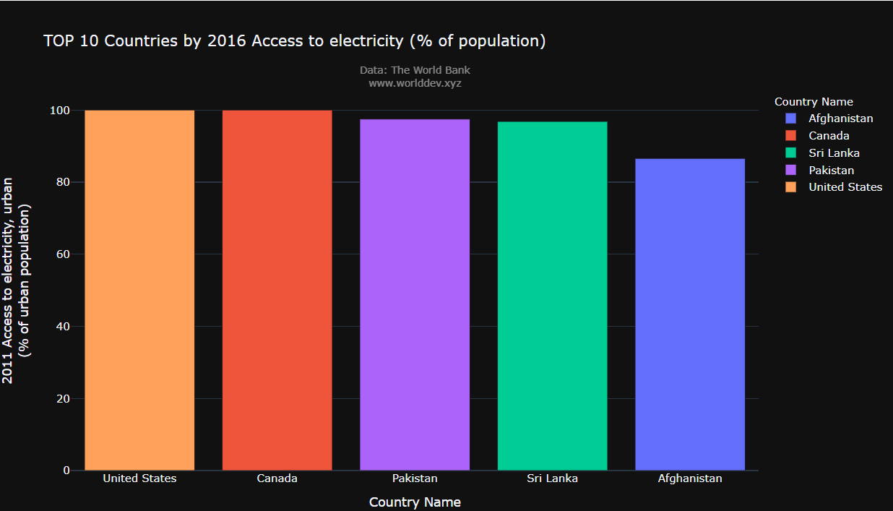
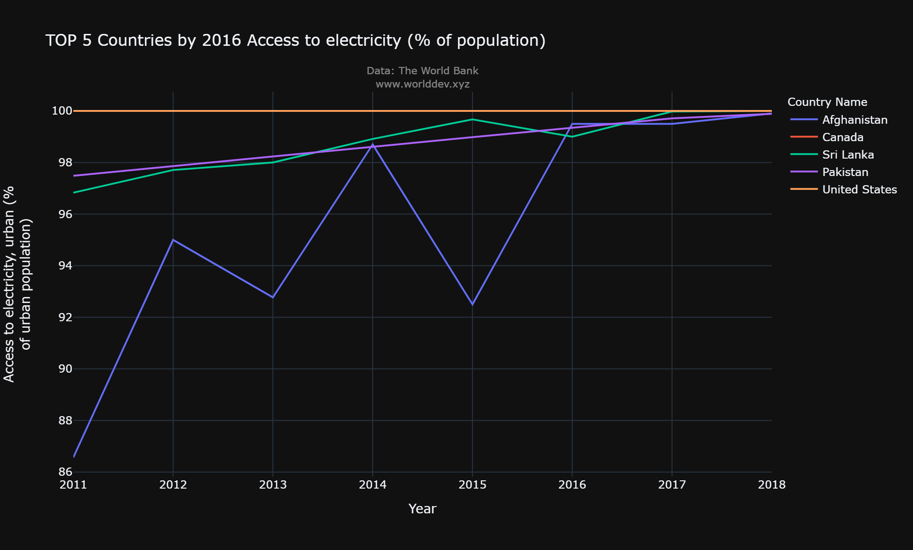
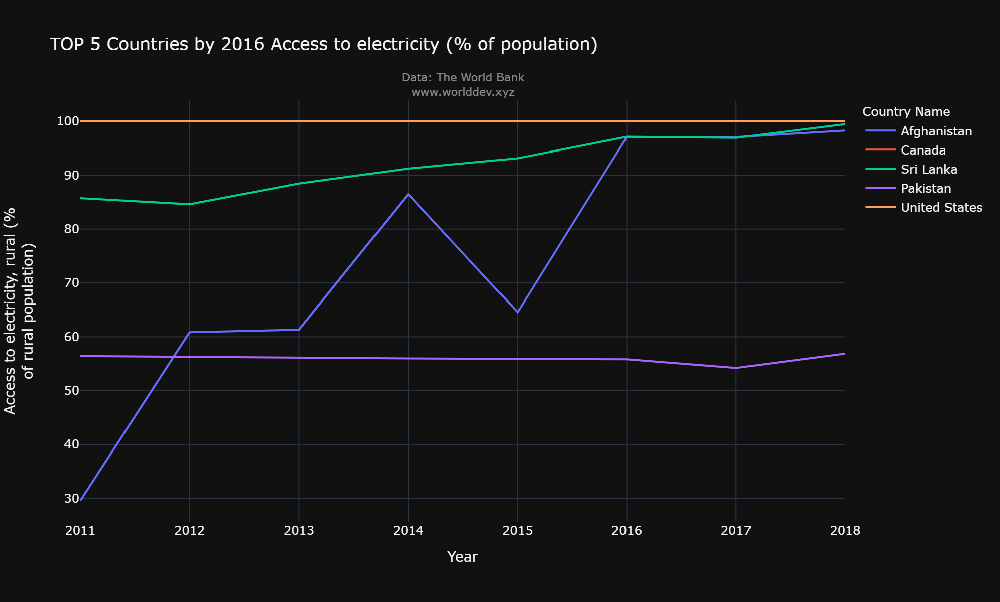
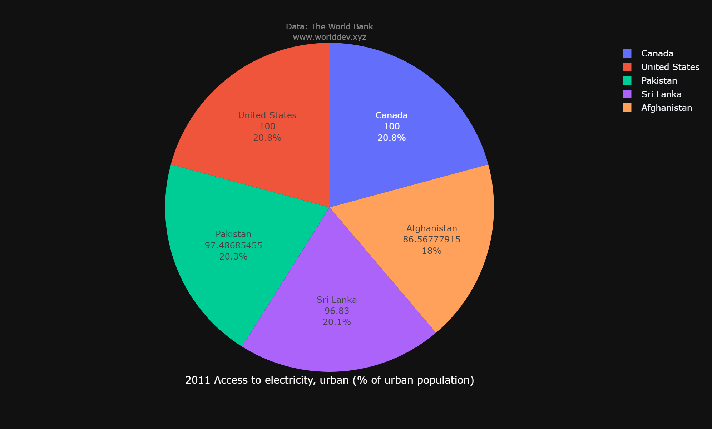
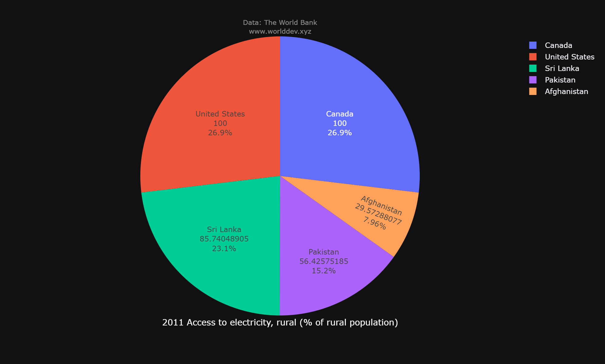
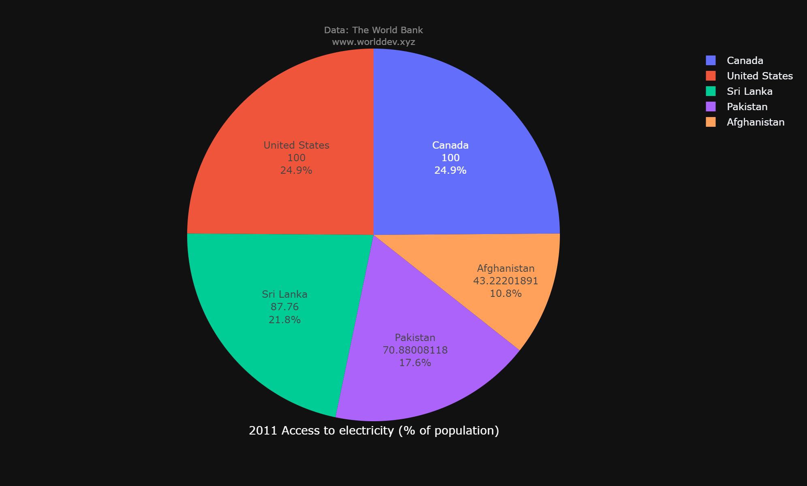

# Energy and Mining
Mining is first and foremost a source of mineral commodities that all countries find essential for maintaining and improving their standards of living. Mined materials are needed to construct roads and hospitals, to build automobiles and houses, to make computers and satellites, to generate electricity, and to provide the many other goods and services that consumers enjoy.

# Why is it important to you and/or to others?
* Electricity is an essential part of modern life and important to the country economy. People use electricity for lighting, heating, cooling, and refrigeration and for operating appliances, computers, electronics, machinery, and public transportation systems.
* I would like to give the breif description of energy and mining including how much eletricity is used, how much of poulation is using eletricity and total production of eletricity.

# Outlook 
To look at usage of eletricity across the world, we'll use World Development Explorer (worlddev.xyz). Below are the countries with the highest and lowest access to eletricity, based on 2016 World Bank data

* In the year 2016, 100% of population in Canada, United States, were using electricity. In Pakistan and srilanka approximately 95% of population were using electricity and in Afghanistan 86% of people were using the energy source.
* Overall 100% of people in United states and canda were using the of the electricity when compared with other countries.

# Access to electricity, urban(% of Urban population)

* I used a Line Graph to show the difference in urban population using eletricity between Canada, United States, Afghanistan, Pakistan and Sri Lanka over time.
* People in USA and Canada were using the 100% of the electricity. USA and Canada were utilizing the electricity in all aspects.
* There was very much fluctuation in Afghanistan and from the year 2011 to 2018 there are severe up and downs in the usage of energy.
* Urban population in Pakistan and Sri Lanka were slightly increasing in terms of eletrical usage.

# Access to electricity, rural(% of rural population)

* Rural people in USA and Canada were constantly using the electricity. Total Population in both of the countries were using the electricity.
* Aghanistan is constantly fluctuating in both rural and urban areas.
* Srilanka and Pakistan were constantly maintaining the same fluctuation from the year 2011 to 2018

# Access to electricity, urban(% of urban population)

USA and Canada has population who uses electricity 100% in every movement. Pakistan and Srilanka are the next in which more than 95% of urban population were using the electricity. Afghanistan is the only country with the Less percentage of urban population using electricity.

# Access to electricity, rural(% of rural population)

From the above pie chart we can analyse how much rural population were using the eletricity. As from we know USA and Canada were having 100% of rural population using electricity. 86% of Srilanka rural population were using the electricity. Pakistan has the poulation of 57% were using the electricity in that country. Moreover, Afghanistan is the only country with less percentage of rural population using electricity which is approximately 29%.

# Access to electricity(% of population)

From the above pie chart we can see that Both USA and Canada were having the rural and uraban 100% of poulation were using the electricity. When look at the total population in Srilanka only 87% of population using the electricity and with pakistan only 70% of the total population were using the electricity for their needs. Afghanistan is the only country with less then 50% of the total population using the electricity. 

# Conclusion
Overall there is lot of usage in every country but when compared with the top countries with highest usage of electricity lower countries usage is verry less. Due to, there is no severe action by the government. All countries are trying very hard to overcome this situation but many of them are facing many problems like shortage of water and fossil fuels. Countries have to try more to overcome this situation by using the solar and wind energy it will be very much helpful so that, there can be no other emissions like some distinct gases.
