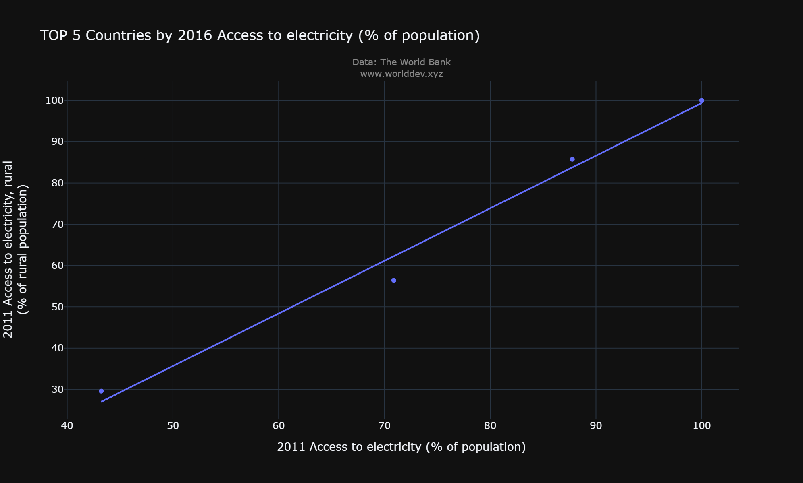
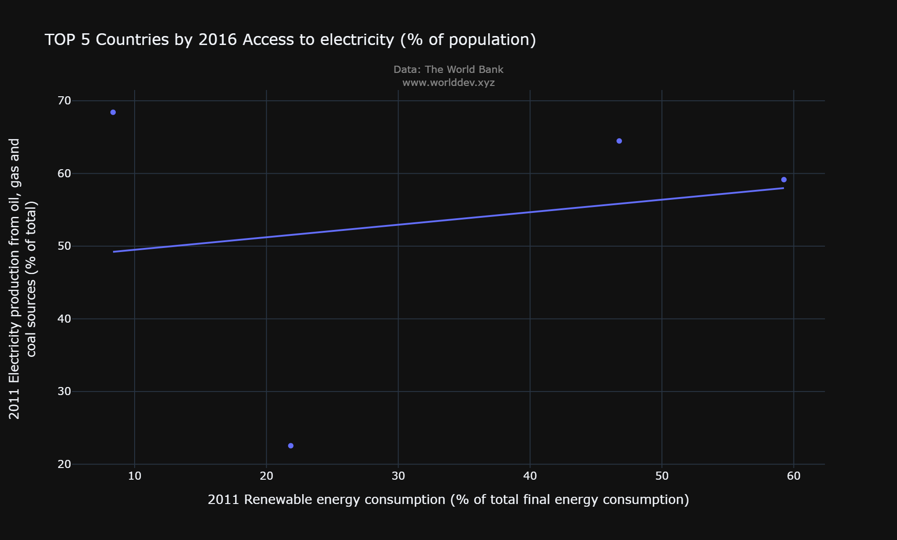

# Energy and Mining
Mining is first and foremost a source of mineral commodities that all countries find essential for maintaining and improving their standards of living. Mined materials are needed to construct roads and hospitals, to build automobiles and houses, to make computers and satellites, to generate electricity, and to provide the many other goods and services that consumers enjoy.

# Why is it important to you and/or to others?
* Electricity is an essential part of modern life and important to the country economy. People use electricity for lighting, heating, cooling, and refrigeration and for operating appliances, computers, electronics, machinery, and public transportation systems.
* I would like to give the breif description of energy and mining including how much eletricity is used, how much of poulation is using eletricity and total production of eletricity.

# Outlook 
To look at usage of eletricity across the world, we'll use World Development Explorer (worlddev.xyz). Below are the countries with the highest and lowest access to eletricity, based on 2016 World Bank data

* In the year 2016, 100% of population in Canada, United States, were using electricity. In Pakistan and srilanka approximately 95% of population were using electricity and in Afghanistan 86% of people were using the energy source.
* Overall 100% of people in United states and canda were using the of the electricity when compared with other countries.

# Access to electricity, urban(% of Urban population)

* I used a Line Graph to show the difference in urban population using eletricity between Canada, United States, Afghanistan, Pakistan and Sri Lanka over time.
* People in USA and Canada were using the 100% of the electricity. USA and Canada were utilizing the electricity in all aspects.
* There was very much fluctuation in Afghanistan and from the year 2011 to 2018 there are severe up and downs in the usage of energy.
* Urban population in Pakistan and Sri Lanka were slightly increasing in terms of eletrical usage.

# Access to electricity, rural(% of rural population)

* Rural people in USA and Canada were constantly using the electricity. Total Population in both of the countries were using the electricity.
* Aghanistan is constantly fluctuating in both rural and urban areas.
* Srilanka and Pakistan were constantly maintaining the same fluctuation from the year 2011 to 2018

# Total population correlation with urban population

* I have included only  5 countries in this scenario. The above graph tells us about the correlation between the total population using electricity in those countries and the urban poulation people using the energy source. 
* Again the linear regression in the above graph the people in Afghanistan were not using the electricity in the urban area when compared with the total population throughout the other countries.
* USA and Canada were the total population and urban population are equal and srilanka and pakistan are constantly increasing throughout the years.

# Total population correalation with rural population

Again by using linear regression to find out the correlation between the total popualtion and rural population. It seems to be Afghanistan is rural population is slight change in usage of electricity and moreover USA and Canada were constantly mainataining the same scenario as well like the urban population. From the year 2011 to 2018 people are very much interested to increase in the energy usage in Srilanka and Pakistan.

# Renewable energy correlation production from oil, gas and coal sources

As usual, USA and Canada were using the the highest renewable energy  and production from oil, gas and coal sources tp produce the electricity. Aghanistan is vrey less in using the renewable sources. Pakistan and Srilanka were using constanly in a limit to increase the usage of electricity. 
